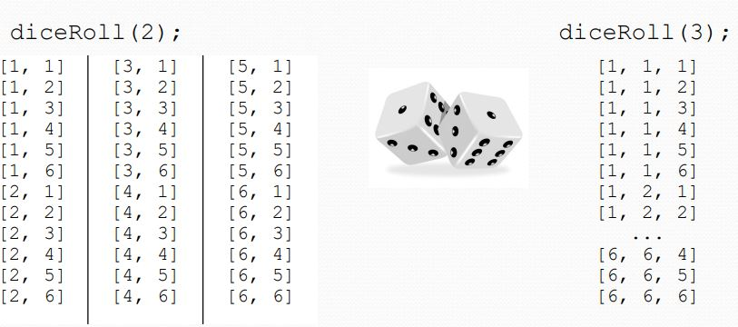
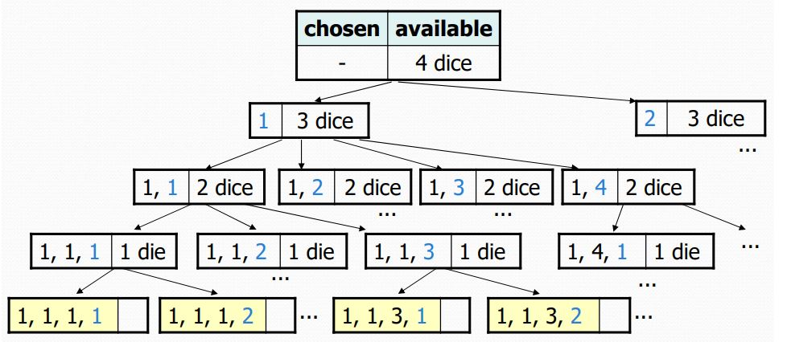
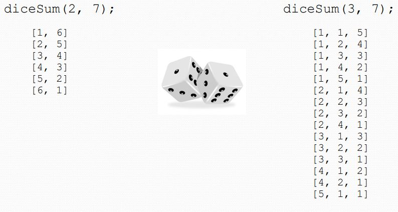
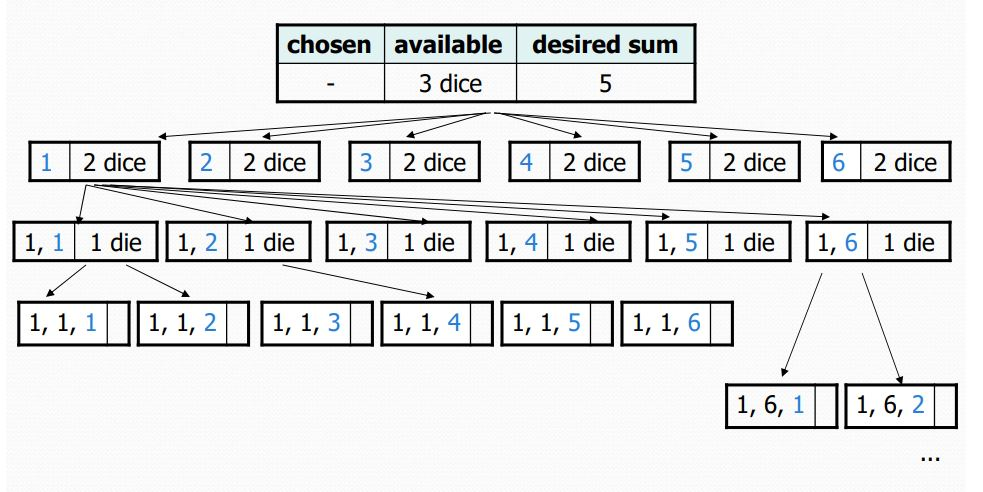
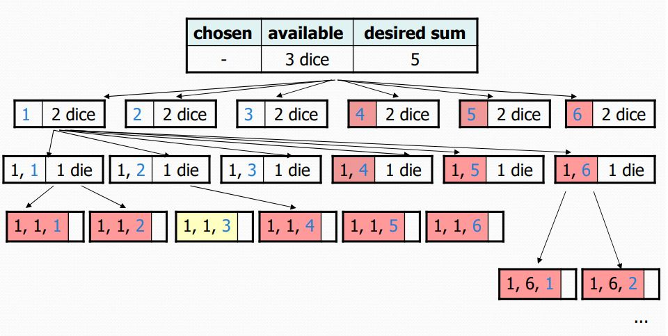
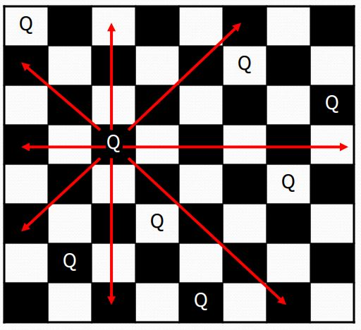

# Рекурсивное программирование
## Рекурсия и случаи

Каждый рекурсивный алгоритм включает как минимум 2 случая:

+   **базовый вариант**: простая задача, которую можно решить напрямую (например, факториал).
+   **рекурсивный случай**: более сложное возникновение проблемы, на которое нельзя дать прямой ответ, но вместо этого его можно описать в терминах меньших случаев возникновения той же проблемы.
+   Некоторые рекурсивные алгоритмы имеют более одного базового или рекурсивного случая, но у всех есть хотя бы один из них.
+   Важной частью рекурсивного программирования является выявление этих случаев.

Попробуйте решить следующую задачу:
Написать рекурсивный метод pow, принимающий два целочисленных параметра и возвращающий степень первого число во втором.

Например, pow(3, 4) вернет 81.

Решите используя рекурсию и без циклов.

 

Попробуйте оптимизировать метод используя правило 3^{12}=531441=9^6=(3^2)^6=((3^2)^2)^3

## Трекинг алгоритма

*Стек вызовов: вызов методов, запущенных в данный момент.*

Попробуйте запустить следующий код:
```java
public static void reverseLines(Scanner input) {  
    if (input.hasNextLine()) {  
        String line = input.nextLine();  
        reverseLines(input);  
        System.out.println(line);  
    }  
}
```

Если выводить на экран строку после входа в рекурсию, то вывод будет обратным.

Упражнение
Напишите рекурсивный метод со строкой в параметре, который возвращает true, если строка читается одинаково с обоих концов. Например: "А роза упала на лапу Азора".


## Сочетание public и private методов

Попробуйте решить следующую задачу:
Напишите рекурсивный метод со строкой в параметре, который возвращает true, если строка читается одинаково с обоих концов. Например: "А роза упала на лапу Азора".

Зачастую необходимых параметров недостаточно для решения задачи, а в месте запуска лишние параметры также ни к чему. Поэтому используют пару методов:

1.  public метод - нерекурсивный метод с параметрами для клиента;
2.  private метод - рекурсивный метод с параметрами которые нам необходимы. Обычно такие методы называют вспомогательными (helper).

Попробуйте добавить в решение задачи dirCrawler вспомогательный метод с дополнительным параметром - число отступов. Которое добавит заданное число отступов для вложенных папок.

## Проблемы рекурсии

+   Забыть базовый случай, для выхода из рекурсии
    +   Бесконечная рекурсия приводит к StackOverflowError
+   Работа вдали от базового варианта
    +   Рекурсивный случай должен продвигаться к базовому сценарию
    +   Бесконечная рекурсия приводит к StackOverflowError
+   Недостаточно памяти
    +   Для некоторых входных данных может потребоваться слишком много рекурсивных вызовов: StackOverflowError
+   Повторное выполнение одной и той же подзадачи снова и снова
    +   Усовершенствование алгоритма может сэкономить значительное время

## Рекурсивный возврат

### Упражнение:

Написать метод diceRoll, принимающий в параметре число костей, и выводящий все возможные комбинации.



#### Изучение проблемы

Мы должны сгенерировать все возможные последовательности
```
foreach(все возможные варианты первой кости)  
    foreach(все возможные варианты второй кости)  
        foreach(все возможные варианты третьей кости)  
            ...  
                print!  
  ```

Как мы можем полностью исследовать такое большое пространство поиска?

Решение рекурсивно:

+   Выберите значение для первого кубика
+   Рекурсивно найти значения для оставшейся кости
+   Повторите с другими значениями для первого кубика
+   Каков базовый случай?




<details>
  <summary>Решение</summary>
  
```
// Prints all possible outcomes of rolling the given  
// number of six-sided dice in \[#, #, #\] format.  
// pre: dice >= 0  
public static void diceRoll(int dice) {  
    diceRoll(dice, new ArrayList<Integer>());  
}
  
// Prints all possible outcomes of rolling the given number  
// of six-sided dice in \[#, #, #\] format with chosen  
// as the prefix of all printed.  
private static void diceRoll(int dice, List<Integer> chosen) {  
    if (dice == 0) {  
        System.out.println(chosen);  
    } else {  
        for (int i = 1; i <= 6; i++) {     // for all possible choices  
            chosen.add(i); // choose  
            diceRoll(dice - 1, chosen); // explore  
            chosen.remove(chosen.size() - 1); // unchoose  
        }  
    }  
}
```
  </details>

### Возврат (Backtracking)

+   возврат: поиск решения путем попытки частичного решения, а затем откат если условие стало невыполнимо.
+   алгоритмическая техника "полного перебора" (пробует все пути);
+   часто реализуется рекурсивно.

### Приложения

+   производить все перестановки набора значений
+   синтаксический анализ языков
+   игры: анаграммы, кроссворды, словесные беспорядки, 8 королев
+   комбинаторика и логическое программирование.

Базовый алгоритм:

если вариантов выбора больше нет: остановить алгоритм.  
иначе: - сделать одиночный выбор **С**  
\- перейти к следующему выбору  
\- вернуть выбор **С** (возврат!)  
  
Вернемся к предыдущему упражнению и изменим его. Допустим, теперь нам необходимо вывести все возможные комбинации с определенной суммой.



Древо принятия решений станет следующим:



Оптимизации:

+   нам не нужны все ветви
    +   некоторые ветви уже не подходят
    +   нам незачем их обходить
+   Неэффективность в нашем алгоритме суммы костей:
    +   Иногда текущая сумма уже слишком высока.
        +   (Даже если бы выпала единица для всех оставшихся кубиков превысил бы сумму.)
    +   Иногда текущая сумма уже слишком мала.
        +   (Даже бросок 6 для всех оставшихся кубиков не достигнет суммы.)
    +   По окончании код должен вычислять сумму каждый раз.
        +   (1 + 1 + 1 = ..., 1 + 1 + 2 = ..., 1 + 1 + 3 = ..., 1 + 1 + 4 = ..., ...)



## Задача 8 королев

Классическая задача по поиску с откатом: на шахматной доске расставить 8 королев так, чтобы ни одни из них не била друг друга.



+   Как сделать ход?
+   Как сделать ход и откат хода?
+   Как узнать когда остановиться?

#### Наивный алгоритм

+   foreach (квадрат на доске)
    +   Поставить королеву.
    +   Попробовать поставить остальных.
    +   Переставить королеву.

Какова оценка алгоритма?

64 \* 63 \* 62 \* ...

64!

#### Алгоритм "по-лучше"

Только одна королева может быть выставлена в одной строке или столбце.

Какова оценка алгоритма сейчас? 


#### Вернемся к алгоритму с возвратом

+   если вариантов выбора больше нет: остановить алгоритм.
+   иначе, для каждого возможного варианта:
    +   сделать выбор **С**
    +   перейти к следующему выбору
    +   вернуть выбор **С**, если необходимо. (возврат!)

#### Упражнение

Реализуйте класс Board, со следующими методами:

+   public Board(int size)  // конструктор
+   public boolean isSafe(int row, int column) // true если королева может быть безопасно поставлена на ячейку с номером
+   public void place(int row, int column) // поставить королеву сюда
+   public void remove(int row, int column) // убрать королеву отсюда
+   public String toString() // отобразить доску в текстовом виде

Напишите метод solveQueens, который принимает Board в качестве параметра, и безопасно устанавливает 8 королев.

[Посмотреть решения.](../JavaLessonsProject/src/sem2/L7.java)
