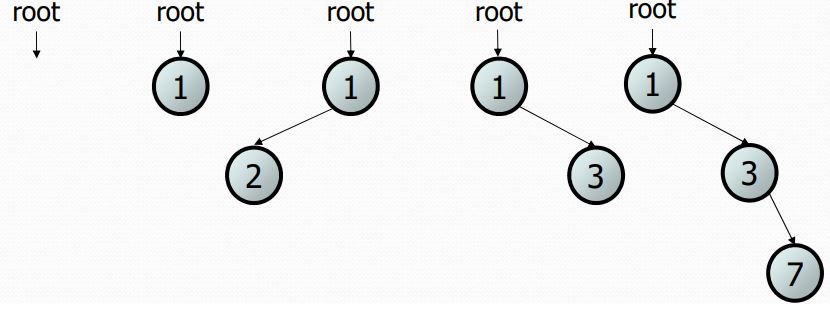

# Бинарные деревья
## Деревья в информатике

+   Реализации классов TreeMap и TreeSet
+   Папки/файлы в компьютере
+   Генеалогические древа
+   Деревья принятия решений
+   Дерево синтаксического анализа
+   Т9

**Дерево** - узлы связаны вместе в некой иерархии.

**Бинарное дерево** - каждый узел имеет не более двух потомков.

Рекурсивное определение: дерево либо:

+   пусто (null), либо
+   корневой узел содержит:
    +   данные
    +   левое поддерево, и
    +   правое поддерево.
        +   (они могут быть пустыми).


Рекурсивно:



#### Терминология

+   узел (node) - объект содержащий данные и левый/правый потомок
    +   корень (root) - корневой или верхний элемент дерева
    +   лист (leaf) - узел без потомков
    +   ветвь или путь (branch) - любой внутренний узел, ни корень, ни лист
    +   родитель (parent) - узел который ссылается на данный
    +   потомок (child) - узел на который ссылается данный
    +   (сосед) sibling - узел с общим родителем
+   поддерево или вложенное дерево (subtree) - меньшее левое или правое дерево  от текущего
+   высота (height) - наибольшая длина от корневого элемента до любого
+   уровень (level or depth) - длина пути от корневого до текущего.

### Дерево для целых чисел

Базовый объект дерева хранит данные и ссылается к левому / правому  
• Несколько узлов могут быть связаны вместе в большее дерево


```java
// An IntTreeNode object is one node in a binary tree of ints.  
public class IntTreeNode {  
    public int data; // data stored at this node  
    public IntTreeNode left; // reference to left subtree  
    public IntTreeNode right; // reference to right subtree  
 // Constructs a leaf node with the given data.    public IntTreeNode(int data) {  
        this(data, null, null);  
    }  
    // Constructs a branch node with the given data and links.  
    public IntTreeNode(int data, IntTreeNode left,  
                       IntTreeNode right) {  
        this.data = data;  
 this.left = left;  
 this.right = right;  
    }  
}  
  
// An IntTree object represents an entire binary tree of ints.  
public class IntTree {  
    private IntTreeNode overallRoot; // null for an empty tree  
  
    **methods**  
}  
```
  

Взаимодействие происходит через класс IntTree, а не с узлами внутри него.


Напишем метод вывода значений IntTree на экран
```java 
private void print(IntTreeNode root) {  
    if (root != null) {  
        System.out.print(root.data + " ");  
        print(root.left);  
        print(root.right);  
    }  
}  
  
// 17 41 29 9 81 40

// В зависимости от расположения вывода, он может меняться.

// Если запустить внутри

private void print(IntTreeNode root) {  
    if (root != null) {  
        print(root.left);  
        System.out.print(root.data + " ");
        print(root.right);  
    }  
}

// выведет 29 41 17 81 9 40

// А если после обхода,

private void print(IntTreeNode root) {  
    if (root != null) {  
        print(root.left);  
        print(root.right);  
        System.out.print(root.data + " ");
    }  
}

// то 29 41 81 40 9 17.
```

#### Упражнение

Напишите метод contains для IntTree, который ищет заданное число в дереве, и возвращает true если найдено.

#### Шаблон для класса дерева
```java
    public class IntTree {  
        private IntTreeNode overallRoot;  
            //...  
        public type name(parameters) {  
            name(overallRoot, parameters);  
        }  
        private type name(IntTreeNode root, parameters) {  
            //...  
        }  
    }
```
Зачастую методы деревьев реализуются рекурсивно:

+   с парой public / private
+   private версия принимает корневой элемент

**Упражнение**

Добавить метод printSideways, который выводит дерево вертикально так, что правые узлы окажутся на верху вывода, а левые внизу.

Например:


## Бинарное дерево поиска

*Какова оценка эффективности выявления того, что значение содержится в неотсортированном массиве?*

*Что на счет отсортированного массива?*

Двоичное дерево поиска ("BST"): двоичное дерево, где каждый непустой узел R имеет следующие свойства:

+   элементы левого поддерева R содержат данные меньше чем R
+   элементы правого поддерева R содержат данные больше чем R
+   Левое и правое поддеревья R также являются деревьями двоичного поиска.

Бинарные деревья поиска хранят свои элементы в отсортированном порядке, что полезно для задач поиска / сортировки.

### Поиск в бинарном дереве

+   Опишите алгоритм поиска в бинарном дереве, попробуйте найти 31, а затем 6.
+   Сколько узлов вам необходимо проверить чтобы найти нужный?


#### Упражнение

Переделайте класс IntTree в SearchTree и перепишите метод contains.
<details>
  <summary>**Решение:**</summary>
  
```java
// Returns whether this BST contains the given integer.  
public boolean contains(int value) {  
    return contains(overallRoot, value);  
}  
private boolean contains(IntTreeNode node, int value) {  
    if (node == null) {  
        return false; // base case: not found here  
    } else if (node.data == value) {  
        return true; // base case: found here  
    } else if (node.data > value) {  
        return contains(node.left, value);  
    } else { // root.data < value  
        return contains(node.right, value);  
    }  
}  
  ```
</details>

### Добавление элементов

Допустим нужно добавить новые значения в следующее дерево:


+   Куда мы должны добавить 14?
+   А куда 3? 7?
+   А если дерево пустое?
+   Каков общий алгоритм?

#### Упражнение

Добавьте метод add в класс SearchTree, который добавляет новый элемент в нужной позиции, сохранив сортировку.


<details>
  <summary>Решение</summary>
  
```java
    // Adds the given value to this BST in sorted order.  
    public void add(int value) {  
        add(overallRoot, value);  
    }  
    private void add(IntTreeNode node, int value) {  
        if (node == null) {  
            node = new IntTreeNode(value);  
        } else if (node.data > value) {  
            add(node.left, value);  
        } else if (node.data < value) {  
            add(node.right, value);  
        }  
        // else node.data == value, so  
        // it's a duplicate (don't add)  
    }
```
</details>

Почему это решение не работает?

### Шаблон x = change(x)

Какое значение будет иметь p, после вызова метода?

```java
public static void change(Point thePoint) {  
    thePoint.x = 3;  
    thePoint.y = 4;  
}  
public static void main(String[] args) {  
    Point p = new Point(1, 2);  
    change(p);  
    System.out.println(p);  
}
```

<details>
  <summary>Ответ</summary>
   (3, 4)
  </details>
  
А теперь?

```java
public static void change(Point thePoint) {  
    thePoint = new Point(3, 4);  
}  
public static void main(String[] args) {  
    Point p = new Point(1, 2);  
    change(p);  
    System.out.println(p);  
}
```

<details>
  <summary>Ответ</summary>
   (1, 2)
  </details>
  
  
#### Передача параметров
+ Примитивные параметры, такие как int или double, передаются в методы по значению (pass by value).
Это означает, что любые изменения значений параметров существуют только в рамках метода. 
Когда метод возвращается, параметры исчезают и любые изменения в них теряются.
+ Ссылочные типы данных, такие как объекты, также передаются в методы по значению. 
Это означает, что когда метод возвращается, переданная ссылка все еще ссылается на тот же объект, что и раньше. 
Однако значения полей объекта могут быть изменены в методе, если они имеют надлежащий уровень доступа 
(видно в первом примере и примере ниже, также см, например, [1]).

#### Изменение ссылки

+   Если метод разыменовывает переменную и изменяет объект, на который он ссылается, то это изменение будет видно вызывающей стороне:

```java
public static void change(Point thePoint) {  
    thePoint.x = 3; // affects p  
    thePoint.setY(4); // affects p
```

+   Если метод переназначает переменную для ссылки на новый объект, это изменение не повлияет на переменную, переданную вызывающей стороной.
Поскольку ссылка была передана по значению и не может быть изменена.
Внутри метода объект, на который указывает указатель thePoint изменился, но, когда метод возвращается, 
thePoint все еще ссылается на тот же Point объект, что и до вызова метода.

```java
public static void change(Point thePoint) {  
    thePoint = new Point(3, 4); // p unchanged  
    thePoint = null; // p unchanged
```

Какое значение точки будет теперь?
```java
public static void main(String[] args) {  
    Point p = new Point(1, 2);  
    change(p);  
    System.out.println(p);  
}  
public static Point change(Point thePoint) {  
    thePoint = new Point(3, 4);  
    return thePoint;  
}
```

<details>
  <summary>Ответ</summary>
   (1, 2)
  </details>

А теперь?

```
public static void main(String[] args) {  
    Point p = new Point(1, 2);  
    p = change(p);  
    System.out.println(p);  
}  
public static Point change(Point thePoint) {  
    thePoint = new Point(3, 4);  
 return thePoint;  
}
```


<details>
  <summary>Ответ</summary>
   (3, 4)
  </details>

#### x = change(x);

+   Если вы хотите написать метод, который может изменить объект, на который ссылается переменная, вы должны сделать три вещи:  
    1\. перейти в исходное состояние объекта к методу  
    2\. вернуть новый (возможно измененный) объект из метода  
    3\. переназначить переменную вызывающей стороны для сохранения возвращенного результата

```java
p = change(p); // in main  
public static Point change(Point thePoint) {  
     thePoint = new Point(99, -1);  
     return thePoint;
```

+   Поэтому этот шаблон называют x = change(x);
    +   он также виден при работе со строками: `s = s.toUpperCase();`

+   Как и в случае со связанными списками, если мы просто изменим то, на что ссылается локальная переменная, это не изменит коллекцию.

```java
private void add(IntTreeNode node, int value) {  
    if (node == null) {  
        node = new IntTreeNode(value);  
    }
```

+   Методы, которые изменяют дерево, должны иметь следующий шаблон:
    +   вход (параметр): старое состояние узла
    +   выход (return): новое состояние узла

узел до -> параметр -> метод -> return -> узел после

Чтобы реально изменить дерево, необходимо переназначить:
```java
    node = change(node, parameters);  
    node.left = change(node.left, parameters);  
    node.right = change(node.right, parameters);  
    overallRoot = change(overallRoot, parameters);  
```
Правильное решение:
```java
// Adds the given value to this BST in sorted order.  
public void add(int value) {  
    overallRoot = add(overallRoot, value);  
}  
private IntTreeNode add(IntTreeNode node, int value) {  
    if (node == null) {  
        node = new IntTreeNode(value);  
    } else if (node.data > value) {  
        node.left = add(node.left, value);  
    } else if (node.data < value) {  
        node.right = add(node.right, value);  
    } // else a duplicate; do nothing  
    return node;  
}
```
+   Что произойдет когда узел типа лист?

## Ссылки
1. [Passing Information to a Method or a Constructor](https://docs.oracle.com/javase/tutorial/java/javaOO/arguments.html)